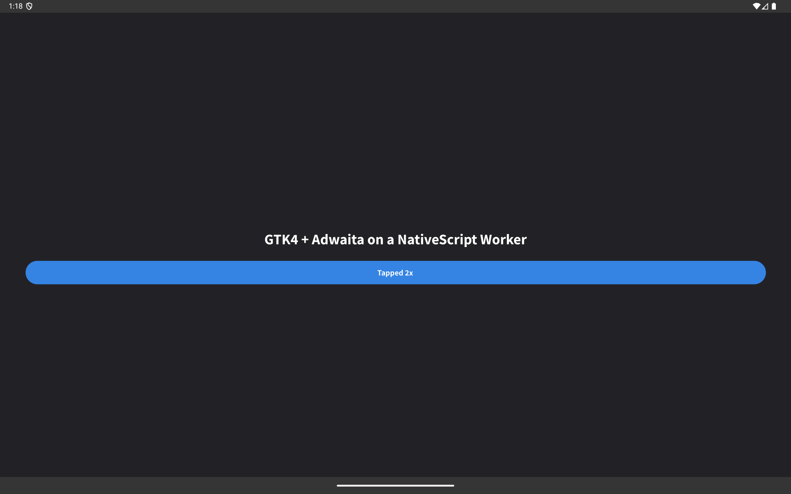

# GTK4 on a NativeScript Worker thread (2026-10-10)

[ADR 0104](../adr/0104-real-gtk-and-gi-on-android-are-opt-in-tracks-beside-the-nativescript-port.md)
stage 5, track C′: can a stock NativeScript app host real GTK4 — with the GTK main loop on a
**Worker** thread, driven by node-gi's ALooper pump — instead of a pixiewood process whose `main()`
calls `g_application_run`? Follows the [stage 4 report](2026-10-10-node-gi-android-stage-4.md).

**Yes.** A GTK4 + Adwaita window renders on Android from a NativeScript Worker, taps reach the JS
handler, the worker reads Android APIs through NativeScript's metadata, and the UI thread keeps
running JS. The app is `com.tns.NativeScriptApplication`; nothing of GTK's `RuntimeApplication`
runs, and the class is not even in the APK.

`adb exec-out screencap` of `emulator-5554` after two `adb shell input tap`s on the button: an
`Adw.ApplicationWindow` with a `Gtk.Label` and a `Gtk.Button` whose click handler has run twice and
relabelled it. Adwaita's dark style, Adwaita's font, GTK's layout — rendered by GTK on a thread
NativeScript created, in an APK whose `Application` is NativeScript's.

## The result

- **Does a NativeScript worker thread have an `ALooper`?** Yes. `WorkerWrapper.cpp:445-494` calls
  `Looper.prepare()` + `Looper.loop()`; the pump armed, no "no ALooper on this thread".
- **Can GDK be initialized without being the `Application`?** Yes, but only from native code the
  host controls — [The four defects](#the-four-defects).
- **Pump ownership per environment:** unchanged by this spike; what it should be is in
  [Pump ownership](#pump-ownership).
- **End-to-end window + button from worker JS, non-blocking?** Yes. Screenshot above; a tap reached
  the handler as `Build.MODEL=sdk_gphone64_x86_64`, and the UI thread logged 130 ticks at
  1-2 ms drift.

Measured on `emulator-5554`, Tablet_API_36, `x86_64`, NativeScript 9.1.1, GTK 4.21 from the
pixiewood runtime. No `FATAL`, no `SIGSEGV`, no ANR in any run.

## Why a worker thread is the right place

GTK's own Android runtime already splits the two loops: `RuntimeApplication.startRuntime()` spawns
`g_thread_new("GTK Thread", …)` and the Android UI thread blocks in `GlibContext.blockForMain()` —
a `g_idle_add_full()` on the **default** GMainContext plus a `CountDownLatch`. The UI thread is
therefore *already* not the GTK thread, and everything the glue does crosses that boundary
explicitly. A NativeScript Worker owning the default context is the same shape with a JS engine on
the GTK side, so `ToplevelActivity.onCreate` → `blockForMain` → `GdkContext.activate()` works
unchanged.

What does change: there is no `g_application_run`. The worker registers the `Adw.Application`,
`set_default()`s it, and the window is created in the `activate` handler that
`GdkContext.activate()` triggers. The pump iterates the context; nothing blocks.

## The four defects

Each one cost a build-install-logcat cycle; each is the kind that produces no useful error.

1. **The host JS did not ship.** The app installs `@gjsify/node-gi` from a published tarball, so
   the worktree's `host.nativescript.js` was not in the bundle and `__NODE_GI_SYSTEM_DIR` silently
   did nothing. The scaffold now copies the three host files over `node_modules/` after install.
2. **`Class.forName(name)` cannot see app classes.** A one-argument `Class.forName` from JS
   resolves against the JNI *caller frame*, and on a worker thread that is the system classloader,
   which does not know `com.tns.*`. The three-argument form with
   `NativeScriptApplication.getInstance().getClassLoader()` works. The same rule bites again in 3
   and 4.
3. **GDK had no `Context`, and `gtk_init` called a method on it.** `JNI_OnLoad` in `libgtk-4.so`
   calls `gdk_android_initialize(env, loader, NULL)` — a **NULL** activity — and `gdkandroidinit.c`
   caches `a_context.get_system_service` against it. Creating the `Adw.Application` aborted the
   process: *"JNI DETECTED ERROR IN APPLICATION: can't call … Context.getSystemService … on null
   object"*. Normally `startRuntime()` supplies the Application, and a JS host must not call
   `startRuntime` — it dlopens an application library and spawns its own thread. So node-gi now
   calls `gdk_android_initialize` itself with a real Context (`src/android-gdk.cc`). GTK's own
   comment on that call ("This is *really* questionable, as thiz isn't actually an activity. I've
   updated the code to handle this case") is the upstream licence for passing the Application: it
   carries `gtk_init` until a real `ToplevelActivity` reports itself through
   `GdkContext._set_latest_activity()`.
4. **A dlopen runs no `JNI_OnLoad`, so the addon had no `JavaVM`.** NativeScript's
   `system_lib://libnode_gi.so` is a plain `dlopen`: the Node-API exports work, but ART never saw
   the library, so its `JNI_OnLoad` never ran — and that is the only way a native library on
   Android gets a `JavaVM`. `JNI_GetCreatedJavaVMs` is in no app-visible library;
   `libNativeScript.so` exports no VM getter either. Loading the library a second time from Java
   does run it and costs nothing (same soname in the same linker namespace is the same handle),
   but ART resolves the library against the **calling class's** classloader:
   - `java.lang.System.loadLibrary('node_gi')` from JS → *"dlopen failed: library libnode_gi.so
     not found"*, the system classloader again (defect 2).
   - `System.load()` with the absolute path from `ApplicationInfo.nativeLibraryDir` → no
     exception, but still no `JavaVM`.
   - A class **in the APK** whose static initializer calls `System.loadLibrary("node_gi")`,
     initialized through the three-argument `Class.forName` → works.

   So the one Java file this needs is unavoidable, and `__NODE_GI_ANDROID_JNI_BOOTSTRAP` names it.
   `JNI_OnLoad` uses the moment to cache the app's classloader as well: during a load ART performs,
   `FindClass` resolves app classes, and that is the only such moment this library gets.

## What changed in node-gi

All of it is Android-only and opt-in; on Linux the new exports answer `false` and nothing else
moves.

- **`src/android-gdk.cc`** (new): `androidInitGdk(contextClass, contextMethod, signature)` —
  `dlopen`s `libgtk-4.so`, `dlsym`s `gdk_android_initialize` and calls it with the Context the host
  names and that Context's classloader. Idempotent. Plus `androidHasJavaVm()`,
  `androidRegisterJniBootstrap(jniClassName)` and the addon's `JNI_OnLoad`.
- **`src/android-log.cc`** (new): GLib's print/printerr/default-log/writer handlers onto logcat,
  installed from `Init`. On Android stdout and stderr go to `/dev/null`, so without it every
  `g_warning` explaining a refused GI or GTK call is lost — the most expensive failure mode there
  is. GTK installs the same four handlers in `startRuntime()`, which a JS host cannot call.
- **`host.nativescript.js`**: `__NODE_GI_SYSTEM_DIR` (sets `XDG_DATA_DIRS`, `XDG_CONFIG_DIRS` and
  `FONTCONFIG_PATH` from `<dir>/{share,etc,etc/fonts}` — GTK finds its icons, schemas and
  `gtk/gtk-4.0` data there), `__NODE_GI_ANDROID_GDK` and `__NODE_GI_ANDROID_JNI_BOOTSTRAP`.
- **`test/host-nativescript.test.mjs`**: the globals and the bootstrap escalation, on Linux,
  against a fake `java`/`com` and a fake addon.

## Pump ownership

Unchanged by this spike, and worth stating because the spike puts the pump somewhere new. The pump
is per **thread**, not per process: `startMainLoop()` acquires the default GMainContext on the
calling thread and adds that context's poll fds plus a `timerfd` to **that thread's** `ALooper`.
`requireGi()` calls it implicitly, so the owner is whichever thread first imports a namespace.

Here the UI thread also imports node-gi (it reports the worker's progress), and two pumps on one
default context coexisted for the whole run with no contention — because the UI thread's import
happened after the worker had acquired the context, so its `g_main_context_acquire` failed and it
pumps nothing. That is luck, not design. Proper ownership would be explicit: a host asks for the
pump on the thread that will own the loop, and a second request on another thread is an error
rather than a silent no-op. Out of scope for a spike; noted for the stage that productizes this.

## Limits and what is not answered

- **EGL fails in the emulator** (`GdkAndroidDisplay.init_egl failed`), so this is GTK's software
  renderer. Unchanged from the stage-2 finding; still unmeasured on real hardware.
- `gdk_draw_context_frame_presented: assertion 'presentation_time != 0' failed` on every frame
  callback — harmless here, not investigated.
- **Startup cost** is not measured, and the GTK data directory (`share/` + `etc/`) is 8.9 MB on top
  of 34 `.so` files.
- **Accessibility and the soft keyboard** are what ADR 0104 rejected real GTK over for general
  apps. This spike changes nothing about them.
- **No lifecycle work.** Nothing handles the Activity being destroyed and recreated, the app being
  backgrounded, or the worker terminating.
- **x86_64 emulator only**, one Adwaita window. No arm64 device run.

## Reproducing

Outside the repo, under `~/.cache/gjsify-android/`: `ns/setup-gtkworker.sh` scaffolds the whole app
(manifest, gradle, GTK's Java glue minus `RuntimeApplication`, the `.so` files, `app/gtkdata`, the
`JniBootstrap` class) and `ns/build-node-gi-wt.sh x86_64` cross-compiles `libnode_gi.so` from a
worktree. Then `npx nativescript prepare android`, `./gradlew assembleDebug -Pabis=x86_64`, install,
and `am start -n dev.gjsify.gtkworker/com.tns.NativeScriptActivity`.
