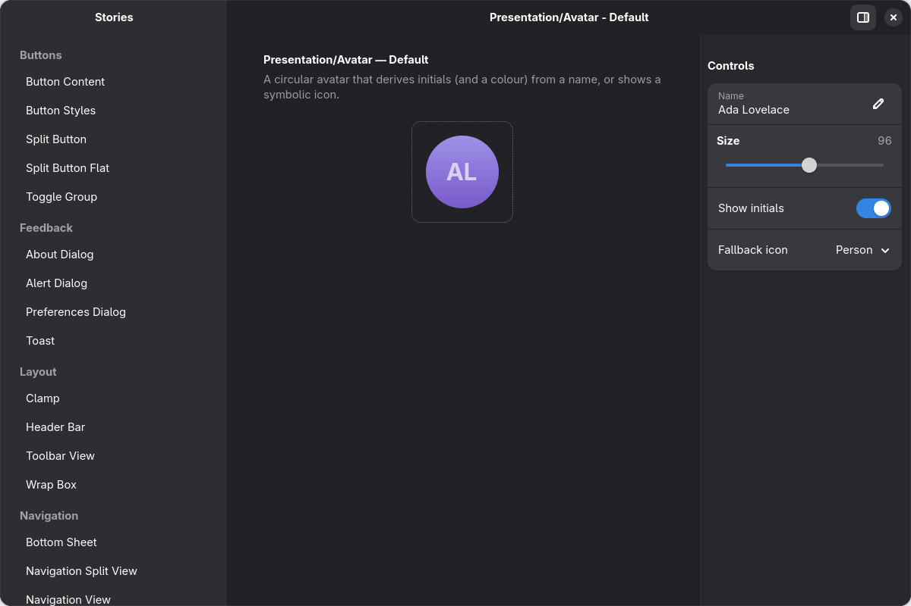

# @gjsify/example-gtk-adwaita-storybook

An interactive **component browser for [Libadwaita](https://gnome.pages.gitlab.gnome.org/libadwaita/)**
widgets — the GNOME equivalent of a web "storybook". Each widget is rendered live, in
isolation, with a two-way-bound **Controls** panel so you can poke at its properties and
watch it update. 35 stories across 7 categories.

Part of the [gjsify](https://github.com/gjsify/gjsify) project — Node.js and Web APIs for GJS (GNOME JavaScript).

It is a showcase for three pieces of gjsify tooling working together:

- **[`@gjsify/storybook`](../../../packages/framework/storybook)** — the GTK/Adwaita story
  renderer (sidebar by category, live control panel).
- **[`@gjsify/stories`](../../../packages/framework/stories)** — the pure-TS story contract.
- **[`@gjsify/devtools`](../../../packages/framework/devtools)** — a DBus + MCP control plane
  that lets an agent (or you, with `gdbus`) drive and screenshot every story headlessly.



## Targets

| Target | Bundle | Renderer |
|---|---|---|
| GJS / GTK 4 | `dist/gjs.js` (`--app gjs`) | `@gjsify/storybook` — native `Adw.*` widgets |
| Node · Bun · Deno | `dist/gjs.node.mjs` (`--app node`) | the same GTK renderer through the `@gjsify/node-gi` reverse bridge |
| Browser | `dist/browser-main.js` (`--app browser`) | `@gjsify/adwaita-storybook` — `@gjsify/adwaita-web` components |
| Android (NativeScript) | [`adwaita-storybook-nativescript`](../../dom/adwaita-storybook-nativescript) | `@gjsify/storybook-nativescript` — real native NS views |

Every target renders the SAME stories: the renderer-free `*.meta.ts` metadata is exported from
this package's `./metas` barrel and the shared logic lives in
[`@gjsify/storybook-core`](../../../packages/framework/storybook-core), so each renderer is a
thin adapter. That the sets really stay identical is machine-checked —
`scripts/check-storybook-story-parity.mjs` fails when a story is missing a rendering on any
target, or when a target's registration does not reach the rendering it has: the browser list
in `src/browser/stories.ts` and the NativeScript one decide what renders, not the filename. There is no screenshot-comparison harness (#1052); behaviour parity across renderers is
held by the `@gjsify/adwaita-core/conformance` vectors.

## Prerequisites

GJS ≥ 1.86 with GTK 4 and Libadwaita 1.x. `gjsify system-check` reports what is missing.

## Run it

```bash
# from this directory
gjsify storybook            # discover every *.story.ts, build (--app gjs), launch the browser
gjsify storybook --watch    # rebuild + relaunch on change

# without a checkout
gjsify showcase adwaita-storybook
```

`gjsify storybook` reads the `gjsify.storybook` block in [`package.json`](package.json)
(application id, window title, the `src` story dir, and `--globals auto`). No per-project
storybook *app* — just `*.story.ts` files plus the shared renderer.

### On Node, Bun and Deno

The same window and the same stories on the other three runtimes, with GTK reached through
[`@gjsify/node-gi`](../../../packages/node-gi/node-gi) instead of GJS:

```bash
gjsify storybook --runtime node                  # or --runtime bun / --runtime deno
gjsify showcase adwaita-storybook --runtime bun  # without a checkout
```

ONE bundle serves all three (`dist/gjs.node.mjs`), because Node-API is their common native
ABI — there is no per-runtime build, and `build:node` produces it once. `--runtime gjs`
builds the separate `--app gjs` bundle.

This is not a fourth story format. The stories are renderer-free and this is the same native
GTK renderer reached over a different bridge; what a runtime has to prove is that the bridge
holds. All three open the window and claim `org.gjsify.AdwaitaStorybook` on the session bus,
which is exactly what the DBus harness below drives — so "it works there" is a checkable
claim, not a build that merely completed.

### In the browser

The web renderer builds the same stories as `@gjsify/adwaita-web` components:

```bash
gjsify run build:web        # build:browser + build:assets
gjsify run start:browser    # http-server dist; open localhost:8080
```

The `./browser` export is the embeddable entry the project website uses.

## Debug / drive it over DBus + MCP

Launch with the devtools control plane enabled, then drive it from `gdbus`, an MCP client,
or the bundled harness:

```bash
GJSIFY_DEVTOOLS=1 gjsify storybook          # exports org.gjsify.Devtools on the session bus
# in another shell — list + open stories, read/set args:
gdbus call --session --dest org.gjsify.AdwaitaStorybook \
  --object-path /org/gjsify/AdwaitaStorybook/devtools \
  --method org.gjsify.Devtools.ListStories
```

Over MCP (the storybook profile adds `list_stories` / `open_story` / `get_current_story` /
`set_story_arg` on top of the generic `screenshot` / `swap_css` / … tools):

```bash
gjsify debug --profile storybook            # MCP bridge to a running storybook
```

### Screenshot every story

[`tools/shoot-stories.js`](tools/shoot-stories.js) opens each story over the devtools DBus
surface and saves a GSK-rendered PNG of the window — the same path used to review this
showcase:

```bash
GJSIFY_DEVTOOLS=1 gjsify storybook &                       # launch
gjs -m tools/shoot-stories.js org.gjsify.AdwaitaStorybook ./shots   # capture all stories
```

## What it demonstrates

- A real Libadwaita component browser built from `*.story.ts` files alone — no per-project
  storybook application, the renderer and the CLI command are the shared parts
- Two-way-bound live controls over native GObject properties: editing a control writes the
  widget property, and a `notify::` on the widget updates the control
- ONE renderer-free story contract driving four renderings (GTK, Node/Bun/Deno over node-gi,
  browser, NativeScript) — the same `*.meta.ts` metadata, shared across package boundaries
- The `@gjsify/devtools` DBus + MCP control plane: an agent can list and open stories, set
  story args, dump the widget tree and screenshot the window headlessly
- Breadth of the Libadwaita widget set working under gjsify — rows, navigation, view
  switching, dialogs and toasts (see the table below)
- `gjsify storybook` as a first-class workflow: discovery, build, launch, `--watch`, `--runtime`

## Layout

```
src/
  <category>/<name>.meta.ts   renderer-free story metadata (title + controls) — shared by ALL targets
  <category>/<name>.story.ts  the GTK story (StoryWidget subclass)
  metas.ts                    the ./metas barrel the other renderers import
  browser/<category>/<name>.web.ts   the adwaita-web story for the same meta
  browser/{main,embed,stories}.ts + index.html   the browser shell and ./browser export
tools/shoot-stories.js        open + screenshot every story over the devtools DBus surface
```

## Stories

Stories live under [`src/`](src), grouped into category folders. The sidebar group comes
from the `"Category/Name"` story `title`, not the folder.

| Category | Widgets |
|---|---|
| Presentation | Avatar, Banner, StatusPage, Spinner, WindowTitle |
| Boxed Lists | ActionRow, EntryRow, PasswordEntryRow, ComboRow, SpinRow, SwitchRow, ExpanderRow, ButtonRow, PreferencesGroup |
| Buttons | SplitButton, ButtonContent, ToggleGroup, button style classes |
| Layout | Clamp, WrapBox, ToolbarView, HeaderBar |
| Navigation | NavigationView, NavigationSplitView, OverlaySplitView, BottomSheet, Sidebar |
| View Switching | ViewSwitcher + ViewStack, InlineViewSwitcher, Carousel, TabView |
| Feedback | Toast, AlertDialog, AboutDialog, PreferencesDialog |

## Add a story

A story is a `StoryWidget` subclass with a `static getMetadata(): StoryMeta` (the
`"Category/Name"` title groups the sidebar, the `controls` drive the live panel),
exported as a `StoryModule`. See [`src/presentation/avatar.story.ts`](src/presentation/avatar.story.ts)
for the canonical pattern:

```ts
import Adw from '@girs/adw-1';
import GObject from '@girs/gobject-2.0';
import { ControlType, type StoryArgs, type StoryMeta, type StoryModule, StoryWidget } from '@gjsify/storybook';

export class MyStory extends StoryWidget {
    private _widget: Adw.Avatar | null = null;
    static {
        GObject.registerClass({ GTypeName: 'AdwStorybookMyStory' }, MyStory);
    }
    constructor() {
        super(StoryWidget.fromMeta(MyStory.getMetadata(), 'Default'));
    }
    static getMetadata(): StoryMeta {
        return {
            title: 'Presentation/My Widget',
            controls: [{ name: 'text', label: 'Text', type: ControlType.TEXT, defaultValue: 'Hi' }],
        };
    }
    initialize(): void {
        this._widget = new Adw.Avatar({ text: this.args.text as string, size: 96 });
        this.addContent(this._widget);
    }
    updateArgs(_args: StoryArgs): void {
        if (this._widget) this._widget.text = this.args.text as string;
    }
}
GObject.type_ensure(MyStory.$gtype);
export const MyStories: StoryModule = { stories: [MyStory] };
```

Rules of thumb: globally-unique `GTypeName` (prefix `AdwStorybook…`), wrap `Adw.*Row`s in an
`Adw.PreferencesGroup`, give space-filling widgets a `widthRequest`/`heightRequest`, and
present dialogs from a button rather than embedding them.

## Related

- [`@gjsify/storybook`](../../../packages/framework/storybook) — the GTK story renderer
- [`@gjsify/storybook-core`](../../../packages/framework/storybook-core) — the renderer-free logic all targets share
- [`@gjsify/adwaita-storybook`](../../../packages/web/adwaita-storybook) — the browser renderer
- [`@gjsify/devtools`](../../../packages/framework/devtools) — the DBus + MCP control plane
- [`@gjsify/node-gi`](../../../packages/node-gi/node-gi) — the reverse bridge behind the Node/Bun/Deno target
- [`adwaita-storybook-nativescript`](../../dom/adwaita-storybook-nativescript) — the same stories as a native Android app

## License

MIT © Pascal Garber. Libadwaita is LGPL-2.1+ © GNOME contributors.
