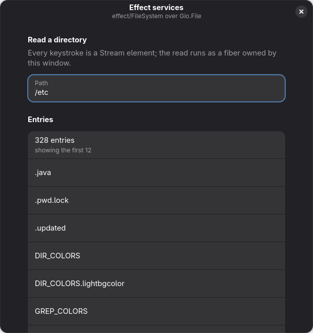
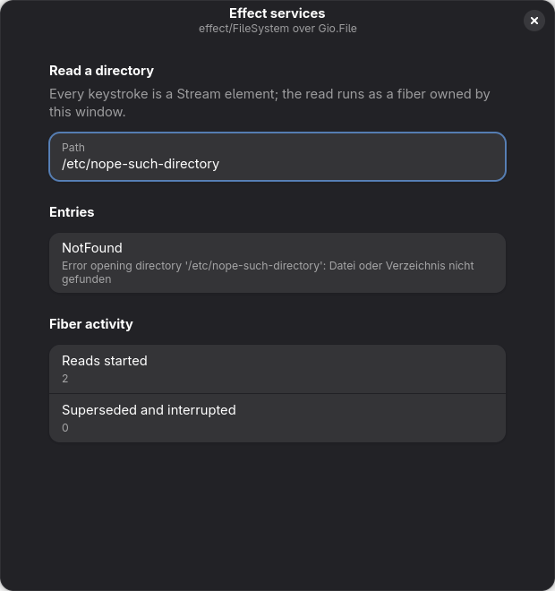

# effect-adw-services

[Effect](https://effect.website) 4 running the **services** behind an Adwaita window on GJS —
typed errors, deterministic resource release, and cancellation that reaches the C library. The
widget tree is Blueprint's; Effect renders nothing.

```bash
gjsify run build && gjsify run start:gjs   # the window
gjsify run probe                           # the assertions, headless
gjsify run shot                            # regenerate the pictures below
```

| a directory read | the same read against a path that is not there |
|---|---|
|  |  |

`NotFound` is Effect's word, not this showcase's — see *one program, two layers* below.

## Why this is not a fourth renderer

`@gjsify/gtk-host` already has three UI frameworks bound to it — React, Vue and Solid — so
"declarative UI over a retained-mode tree" is a solved problem here three times over. Retained
mode was never the hard part for an effect system anyway: immediate mode would be, because a
graph re-evaluated sixty times a second is what makes one expensive, while a GTK tree keeps its
own state and Effect only sequences the mutations.

What no GJS application has is the other half, and this showcase is the small, honest cut: Effect
sits *beside* the widgets and supplies the services.

Those bridges are no longer in this directory. They started here, which was the right first step —
the two design questions they answer (which signal closes a widget scope, and how much of
`FileSystem` a Gio layer should implement) were open until something used them. Both are answered
now, so the code graduated to
[`@gjsify/effect-platform`](../../../packages/framework/effect-platform) per
[ADR 0050](../../../docs/adr/0050-effect-platform-services-for-gnome.md), and this showcase is one
of its consumers:

| entry | what this window uses from it |
|---|---|
| `@gjsify/effect-platform` | `fileSystemLayer` (`effect/FileSystem` on `Gio.File`), `pathLayer` (`effect/Path` on GLib), `reasonOf` (`GError` → a tag) |
| `@gjsify/effect-platform/gtk` | `windowScope`, `runInScope`, `propertyStream` |

Effect's own behaviour is upstream's business and is covered in this repo by
[`tests/integration/effect`](../../../tests/integration/effect), whose counts live in
[`status/integration-coverage.md`](../../../status/integration-coverage.md). This showcase asserts
only what a *running GTK application* can answer.

## Four things measured here, not assumed

**`GtkWidget::destroy` is emitted from `dispose`, not from `gtk_window_destroy()`.** With the
application still holding a JS reference to its window — which is always — on GTK 4.22 /
libadwaita 1.9 / gjs 1.88.1:

| action on a presented `Adw.Window` | signals emitted |
|---|---|
| `close()` | `close-request`, `unrealize` |
| `destroy()` | `unrealize` — **no `destroy`** |
| `run_dispose()` | `unrealize`, `destroy` |

So "close the scope on `destroy`" — the obvious design — leaves a window's fibers running after
the user closes it. `destroy` is exactly right for the question *may a fiber still touch this
widget* (after it, GJS marks the wrapper disposed and every property read is a CRITICAL) and
exactly wrong for *is this window still open*. Hence two functions: `widgetScope` for the
correctness boundary, `windowScope` for the useful one.

**A GIO `*_finish` must run on the object that started the operation.**
`Gio.File.new_for_path(p)` returns a NEW `GFile` each call, and `g_task_is_valid(result, source)`
checks identity. Finishing on a freshly constructed file logged
`g_file_real_enumerate_children_finish: assertion 'g_task_is_valid (res, file)' failed`, returned
`null`, and surfaced one call later as `can't access property "next_files_async", r is null` — a
null dereference that names nothing about the actual mistake. `gioAsync` therefore takes the
source object as a parameter.

**Subscribing to a signal stream is asynchronous, and nothing buffers what beats it.**
`Stream.callback`'s register — where `connect()` happens — runs when the stream is first *pulled*,
and `forkChild({ startImmediately: true })` does not get the fiber that far. An emission before
that is simply not seen. Invisible in an application, where the subscription is set up in a
constructor and the first emission comes from a user; immediate the moment a test emits
programmatically. `propertyStream` starts with the property's *current* value for that reason.

**`Effect.forkIn` is itself an Effect that yields the fiber.** `runFork(forkIn(e, scope))` hands
back a `Fiber<Fiber<A, E>>` — an outer fiber that completes at once with the real one as its
value. Polling it returns a finished `Exit` while the work is still running, which reads exactly
like "the scope never started anything".

## What the window does

Type a path. Each keystroke is a `Stream` element; `debounce` collapses a burst; `switchMap`
starts a directory read and **interrupts the previous one**. Because the read is
`Effect.callback` with its `AbortSignal` wired to a `Gio.Cancellable`, that interruption reaches
GIO and stops the in-flight I/O rather than merely discarding its result — which is what closing
a window mid-read should do, and what no promise-based layer can offer. The two counters at the
bottom of the window make it visible rather than claimed.

A path that does not exist shows `NotFound`, verbatim: that string is Effect's vocabulary, not
this showcase's, and it is what makes the Gio layer a drop-in for the Node one rather than a
lookalike.

## The probe

`runHostProbeApp` from `@gjsify/gtk-host` owns the harness — the `GJSIFY_HOST_PROBE=1` env gate,
the GTK diagnostics collector, the `check()` recorder, the `PROBE: PASS|FAIL <json>` protocol and
the rule that the GUI path runs the same assertions before presenting.

The pictures above are `gjsify run shot`'s output, captured through
`captureWidgetPng` (`Gtk.WidgetPaintable` → `render_texture`) rather than the compositor — no
screenshot portal, same bytes on a headless runner. They are regenerated rather than remembered,
for the reason the probe harness records: the only witness to *did this draw* is the window.

The load-bearing assertion is **one program, two layers**: a single `Effect` that lists a
directory, stats a missing path and asks `exists`, run once against
`fileSystemLayer` and once against `@effect/platform-node-shared`'s `NodeFileSystem.layer`.
Both must return the same listing and the same `NotFound` — including on the failure path, where a
private error vocabulary would have diverged. The mapping is then checked for being a *mapping*:
`Gio.IOErrorEnum.NOT_FOUND` and `GLib.FileError.ISDIR` are both `1`, so a same-coded error from
another domain must come back `Unknown`, and a GIO code Effect has no tag for (`IS_DIRECTORY`)
must come back `Unknown` too rather than a near miss.

## Cost

Measured before the layer was committed to, because "Effect plus your layers is a lot of
JavaScript for SpiderMonkey" was the one objection worth settling first. Importing Effect and
running one effect adds **25 KB** to a GJS bundle and **2 ms** to cold start (12 runs, 45 ms →
47 ms). This window with the platform layer is 213 KB against 165 KB for `adw-blueprint-layout`
and 188 KB for `adw-host-counter`, neither of which uses Effect. Tree-shaking over Effect 4 works.

The `app.gjs.mjs` bundle is larger than that, and deliberately: it also carries
`@effect/platform-node-shared` so the probe can run one program against two FileSystem layers. No
application would ship the second one.

## Why a Blueprint template and not one of the three renderers

The spec this was built from said "through one of the existing renderers", and this window is not
that: its tree is `window.blp` plus a handful of `Adw.ActionRow`s built in TypeScript. The
deviation is deliberate and worth naming rather than glossing.

The claim under test is *Effect touches no widget*, and the strongest evidence for it is that
neither this file nor the platform layer imports a renderer at all. Routing the same window through
React would have added a second thing to be wrong about without making that claim any stronger —
and the three host-counter showcases already answer the rendering question. Blueprint is also what
this repo's own `prefer-blueprint-template` rule asks of an application interface, for a reason
that applies here too: a caption assigned from TypeScript is invisible to `xgettext`.

What is *not* demonstrated, therefore: that these services compose with a gtk-host renderer. They
should, since neither side knows the other exists, but nothing here proves it.
